# 🎓 Smart Classroom – Learning Management System

A full-stack **Learning Management System (LMS)** that enables **Admins, Teachers, and Students** to interact in a modern digital classroom.  
Built with **Spring Boot**, **MySQL**, **HTML, Tailwind CSS, JavaScript**, and **WebSockets (STOMP)** for real-time communication.

---

## 🚀 Project Overview

The **Smart Classroom** project provides a secure and interactive platform for managing classrooms, assignments, announcements, and student-teacher communication.

- **Admins** can invite teachers and manage all users.
- **Teachers** can create classrooms, add students, post assignments, track submissions, and chat in real-time.
- **Students** can join classrooms, submit assignments, comment on announcements, and communicate with teachers.

---

## 🧩 Technologies Used

| Layer         | Technologies / Tools                                |
|---------------|-----------------------------------------------------|
| Frontend      | HTML, Tailwind CSS, JavaScript                      |
| Backend       | Java (Spring Boot), REST APIs, WebSockets (STOMP)   |
| Database      | MySQL                                               |
| Security      | JWT (JSON Web Tokens)                               |
| Email Service | Spring Mail (for invitations & credentials)         |
| Architecture  | Layered (Controller, Service, Repository, DTO, etc) |
| Tools         | IntelliJ IDEA, Postman, Git, Maven                  |

---

## 📸 Screenshots

#### Register & Login Page
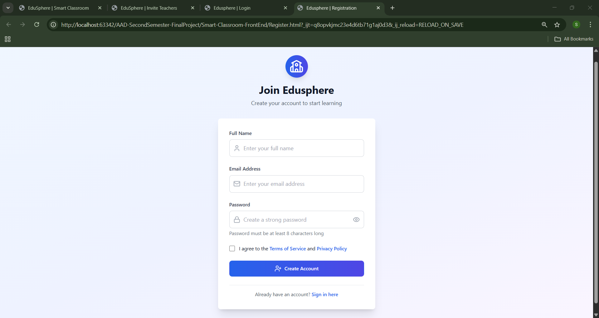

#### Message Page
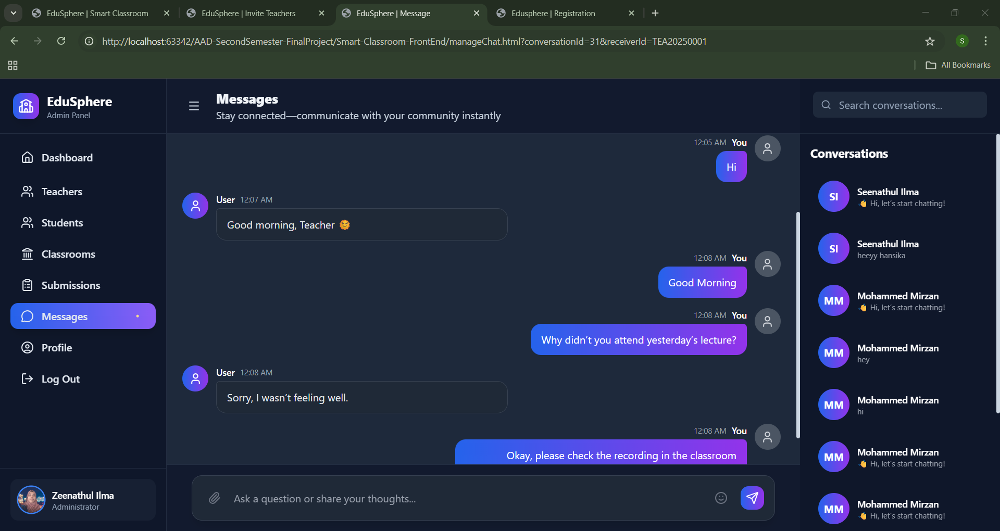
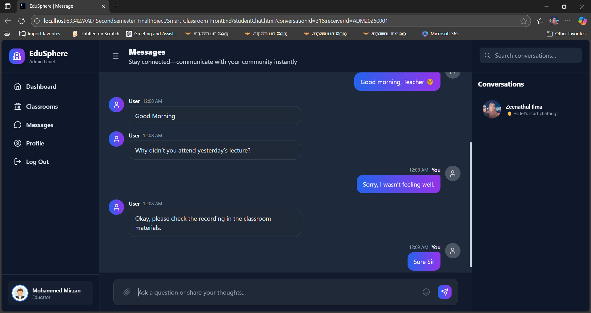
#### Teachers & Students Page
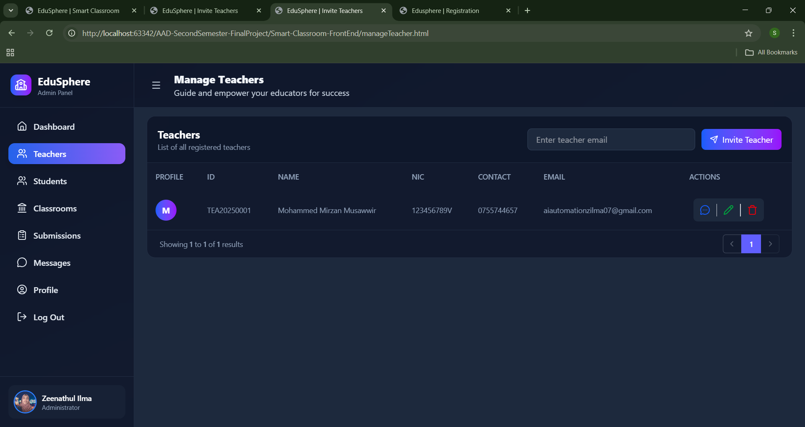
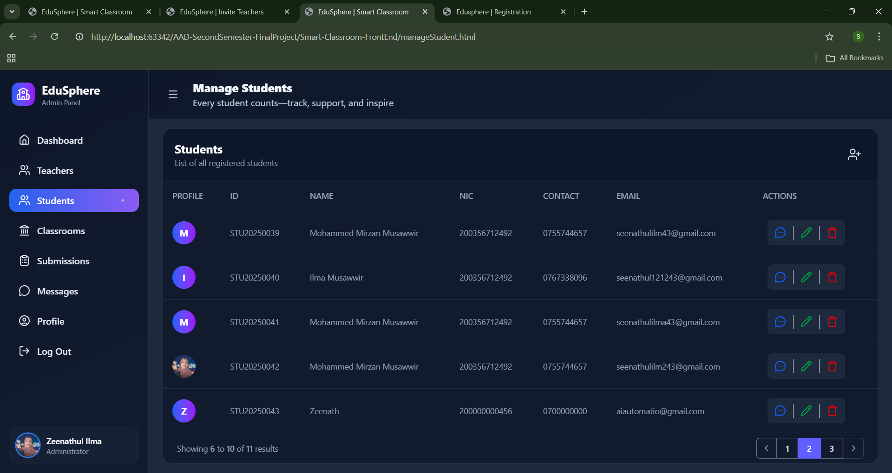
#### Classroom Page
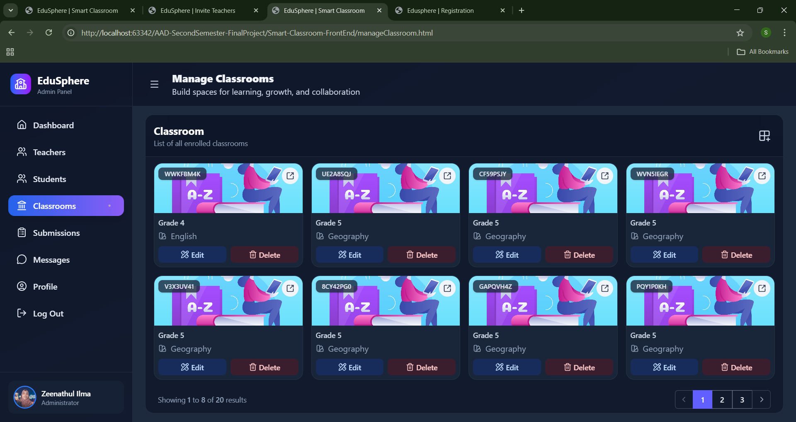
#### Assignments, Announcements, Members (Classroom Page tabs)
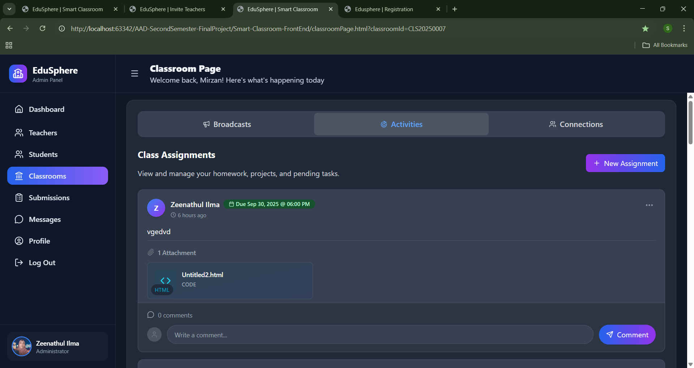
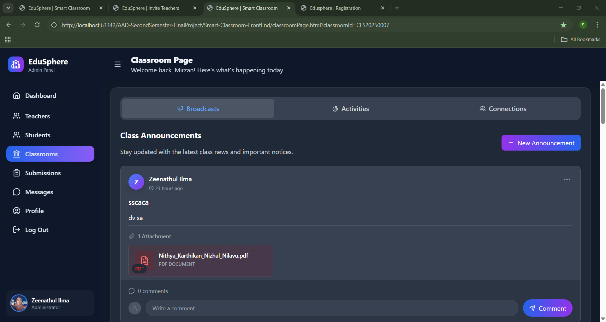
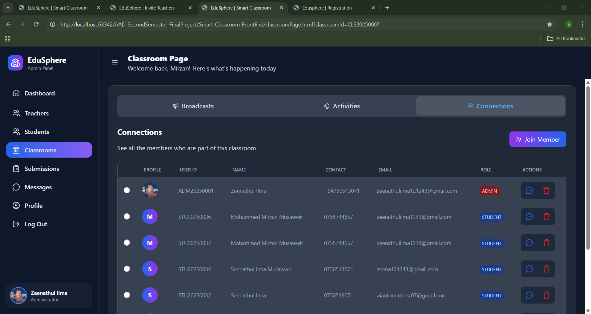
#### Assignment Submission Tracking Page
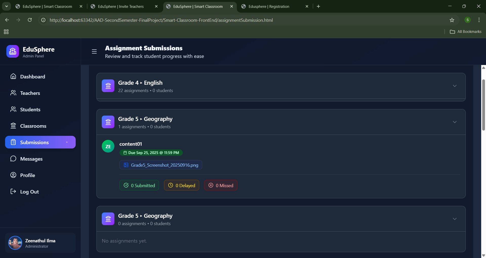
#### Profile Page
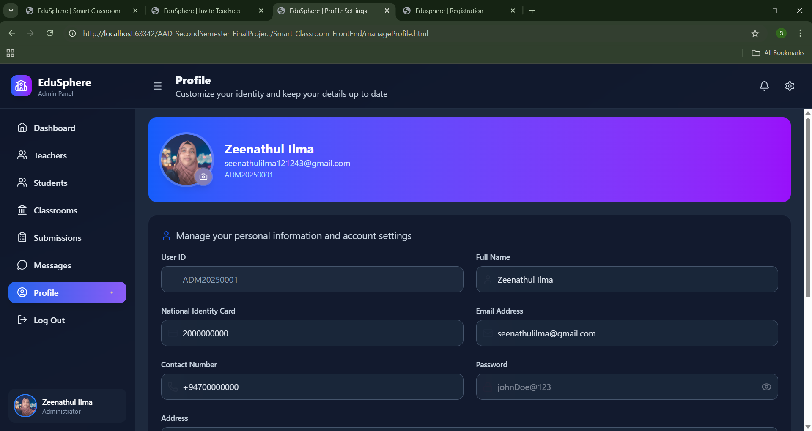

## 🎥 Demo Video link (YouTube project video)
https://youtu.be/ULRt-GtLsv8?si=G59j4c40n2V0k1bo

## 📂 Project Structure

### 🔹 Backend (Spring Boot)
- **Controller** – Handles incoming HTTP requests
- **Service & Impl** – Contains business logic
- **Repository** – JPA repositories for DB access
- **Entity** – Database mapping classes
- **DTOs** – Transfer objects for clean data exchange
- **Config** – JWT & WebSocket configurations
- **Utils** – Email service, token handling
- **Initializer** – Auto-create Admin on app startup

### 🔹 Frontend (HTML + Tailwind + JS)
- **Assets** – CSS, icons, and images
- **JavaScript** – Handles API calls & dynamic UI updates
- **HTML Pages** – Role-based views (Admin, Teacher, Student)
- **WebSocket Integration** – Real-time messaging (STOMP)

---

## 🔑 User Roles & Access

| Role        | Capabilities                                                                                  |
|-------------|-----------------------------------------------------------------------------------------------|
| **Admin**   | Invite teachers via email (token with expiry), manage classrooms, students, and teachers      |
| **Teacher** | Create classrooms, add/remove students (email + auto password), post announcements/assignments, track submissions, real-time chat |
| **Student** | Join via class code, submit assignments, comment on announcements, chat with teachers         |

---

## 📊 Key Features

- 📧 **Email Invitations** – Secure teacher invites with token expiry
- 🔑 **Auto-Credentials** – Students receive generated passwords by email
- 📢 **Announcements & Assignments** – With comments support
- 📝 **Submissions Tracking** – Organized as *Submitted, Delayed, Missed*
- 💬 **Real-Time Messaging** – Built with WebSockets + STOMP
- 🛡 **JWT Authentication** – Secure role-based access
- 👥 **Bulk User Management** – Add/remove pending students in classrooms

---

## 🔧 How to Run Locally

### 1. Clone the repository
```bash
git clone https://github.com/Seenathul-Ilma/AAD-SecondSemester-FinalProject
cd smart-classroom
```
### 2. Set Up the Database (Optional)
```sql
CREATE DATABASE edusphere;
```
### 3. Configure the application (application.properties)
```
# Database
spring.datasource.url=jdbc:mysql://localhost:3306/edusphere?createDatabaseIfNotExist=true
spring.datasource.username=your-user-name
spring.datasource.password=your-password
spring.jpa.hibernate.ddl-auto=update

# Server
server.port=8080
```
### 4. Build the Project
```bash
mvn clean install
```

### 5. Run the backend (Backend runs on http://localhost:8080/)
```
mvn spring-boot:run
```
### 6. Run the Frontend
- The frontend is a static site built with HTML, Tailwind, and JavaScript.
- Open the Smart-Classroom-FrontEnd/ folder
- Launch any HTML file (e.g., index.html) in browser with a local server (Chrome/Edge/Firefox, VS Code Live Server, etc).
- The UI will load and interact with the backend running on http://localhost:8080/

---

## 👩‍💻 Author

**Zeenathul Ilma**
- GitHub: [@Seenathul-Ilma](https://github.com/Seenathul-Ilma)
- Website: [zeenathulilma.vercel.app](https://zeenathulilma.vercel.app)

---

## 📝 License 1: Academic and Personal Learning License
This project is © 2025 Zeenathul Ilma. It is not open-source and may not be reused or copied without permission.

This project was created and developed by Zeenathul Ilma as part of academic and personal learning initiatives.
All rights reserved. No part of this project may be copied, reused, or distributed without written permission from the author.

🚫 Copying or reusing this code without permission is strictly prohibited and may result in academic consequences.

## 📝 License 2: Proprietary License
This project is licensed under a [Proprietary License](LICENSE.txt)
